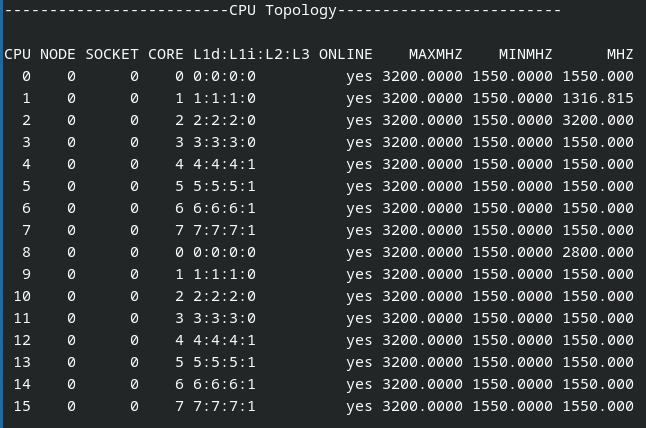

# Single-GPU-Passthrough

This reopsitory was created to share my spin on setting up a virtual machine
for single GPU passthrough. Most of the information here was taken from several
resources I used when coming up with my setup so I won't get into too much of
the basics to keep this short.

## TODO

1. All the other script improvements scattered around the hook scripts
    (Search "@TODO" to find them).
2. Add support for non PCIe device Host Device passthrough
3. Handle empty flags
4. Add support for detecting the network a VM is attached to and its
    configuration (This eliminates the need to specify the network details in
    the VM hooks)
5. Add support for listing services to expose in the description so users don't
    need to edit the hooks
6. Add checks for file existence (in the state folder) before trying to read from
    them
7. Either:
   a. update unloading of drm related kernel modules to not rely on the presence
      of the drm module in lsmod output
   b. find another way to identify them from the main drm module/driver
   c. save the gpu drivers to the relevant location in the state folder and
      unload the modules right after (looks the most promising right now)
8. Add checks to see if requested hardware is in use by another VM

## Credits

First of I would like to acknowledge the various guides and resources I used
to setup my own system for this:

 - [chironjit's guide](https://github.com/chironjit/single-gpu-passthrough) -
    I found this guide to be particularly thorough in detailing the exact steps
    to setup the virtual machine from the recommended BIOS settings up to the
    final VM.

 - SomeOrdinaryGamers videos(
    [I Almost Lost My Virtual Machines...](https://youtu.be/BUSrdUoedTo?t=204) and
    [Indian Man Beats VALORANT's Shady Anticheat...](https://youtu.be/L1JCCdo1bG4?t=208))-
    The first video is his guide which is pretty thorough and the second video
    has details on additional hypervisor settings to facilitate some anti-cheat
    software some games use.

 - [joeknock90's guide](https://github.com/joeknock90/Single-GPU-Passthrough) -
    Most of the content in this guide is covered in chironjit's but this one
    also has some useful troubleshooting tips

 - [bryansteiner's guide](https://github.com/bryansteiner/gpu-passthrough-tutorial) -
    While this guide doesn't cover single GPU passthrough it did help me
    understand the general theory behind passing through hardware to a VM.
    It also contains some useful hypervisor settings to help improve
    virtualization inside the VM (which might be useful for WSL, WSA or other
    software that relies on some Hyper-V features)

 - [Arch Wiki - PCI_passthrough_via_OVMF](https://wiki.archlinux.org/title/PCI_passthrough_via_OVMF) -
    This also doesn't cover single GPU passthrough but has a lot of useful
    information on hardware passthrough in general and also helped me understand
    the theory behind passing through hardware to a VM. This guide also has a
    lot of tips on how to optimise performance inside the VM. A few of the bash
    snippets on that page were used to create the
    [Show-System-Hardware.sh](./Show-System-Hardware.sh) script in this repo

 - [libvirt - Hooks for specific system management](https://libvirt.org/hooks.html) -
    This was useful in understanding how libvirt runs the scripts and the args
    it passes to them.

 - [Linux Kernel Docs - VFIO - “Virtual Function I/O”](https://www.kernel.org/doc/html/latest/driver-api/vfio.html) -
    This resource goes more in depth on how to use the VFIO module

 - [mateussouzaweb's guide - KVM / QEMU Virtualization Guide”](https://github.com/mateussouzaweb/kvm-qemu-virtualization-guide) -
    This guide inspired the changes I made to my original hooks to make them
    more dynamic. The idea to add custom flags in the description of the XML
    to allow changing the scripts run without needing to edit the scripts
    directly was from his scripts.

## Disclaimers

 - The scripts in this repository are provided without any sort of warranty or
    support so run them at your own risk.

 - These scripts were also written with Fedora in mind so they may not work as
    expected on other distros, however the guides listed above were written with
    Pop_OS or Ubuntu based distros in mind so the scripts are mostly portable
    though some minor changes might be required for distro specific things like
    firewall management and Mandatory Access Control software used.

 - The scripts in the hooks folder will be run as root so take care to verify
    their contents before applying them

## Basic Theory

PCI devices connected to the host machine can be grouped into several different
input–output memory management unit (IOMMU) groups. The linux kernel has a
special feature called VFIO (virtual function input-output) that can be used to
isolate each group and expose the interfaces for all the devices in the group
to a virtual machine (VM). This feature is enabled by several kernel modules
that provide several drivers for this purpose. Single GPU passthrough utilises
this feature to expose a GPU to a VM of your choosing.

In order for the vfio-pci module to isolate these devices however there are a
few prerequisites that the devices in the IOMMU group must meet. First, they
must be resettable and secondly they must not be bound to any other drivers
when binding them to the vfio-pci driver (which provided by the vfio-pci
module). Please note however that the module can only isolate whole IOMMU
groups and not individual devices in a given group, so unless you want to
passthrough the other devices in the group as well, it is recommended that you
try to change the PCIe slot that your GPU (or other device you want to pass
through) is connected to. The exception to this rule however are PCI bridge
devices which are
[unsupported by the vfio-pci module](https://www.kernel.org/doc/html/latest/driver-api/vfio.html#vfio-usage-example)
and can thus be ignored for our purposes (even if they is not resettable).
While it is possible to apply the ACS patch to the kernel to work around this
limitation, it isn't guaranteed to work for your system and requires a lot more
knowledge to implement and is outside the scope of this guide.

Typically when passing through hardware to a VM, you would isolate the hardware
on boot so the devices wouldn't be accessible to the host OS. This would mean
that in a system with one GPU you wouldn't have any graphical output of any
kind. To that end, there are a few additional steps needed to dynamically
isolate the GPU so it may be used by both the host OS and VM:

1. kill all tasks that are using the GPU (these include the desktop environment
and possibly any audio management services on the host)
2. unbind the GPU from the drivers that are currently controlling it
3. bind the GPU to the vfio-pci driver so it can control and isolate it

At this point the GPU should be isolated from the host and free to be exposed
to the VM. Of course there are also a few other specific steps related to GPU
passthrough in the scripts however those are the major steps (these also work
for other PCIe devices as well).

## Preparations

 1. Enable IOMMU by adding the following kernel args:
    - For systems with AMD CPUs `amd_iommu=on iommu=pt`
    - For systems with Intel CPUs `intel_iommu=on iommu=pt`
    The exact steps will vary based on your distro.
    - For Fedora run: `grubby --update-kernel=ALL --args="<args here>"`
    - For Pop_OS run: `kernelstub --add-options "<args here>"`
    You'll likely need to elevate privileges with sudo here.

 2. Download and run the [Show-System-Hardware.sh](./Show-System-Hardware.sh).
    You might  need to elevate privileges for it to list out the IOMMU groups.
    The main purpose of the script is to give an overview of your system so you
    can identify what hardware you may passthrough. When you run it you should
    see it output your CPU topology

    Figure 1

    

    and a list of the IOMMU groups in your system and the devices in them like
    this:

    Figure 2

    .png)

    Figure 3

    .png)

    Figure 4

    .png)

    The code on the left of the device name in the form `XXXX:XX:XX.X`
    represents the `domain:bus:device.function` numbers of that device. Going
    forward I'll refer to that code as the pci address of the device. The
    entries with `[RESET]` beside them indicate what devices are resettable
    and are also conveniently coloured green. You can also see what kernel
    modules are associated with the device and what driver is actively
    controling the device. The script also conveniently list any USB devices
    and storage devices connected to a pci device. These also get coloured
    green if the pci device they're attached to is resettable. Lastly this
    script also shows what display ports the GPU has and which ones are in use
    (they also get coloured green if the GPU is resettable). Knowing what
    ports your GPU has is particularly important for those attempting this on
    a laptop. If the dGPU in your laptop has no ports then passing through
    just the dGPU will not provide any graphical accelleration in the VM as
    it is not possible to connect a display to it. You might be able to get it
    working by also passing through the iGPU it is connected to (modifications
    to the ACPI table exposed to VM might also be necessary), but that is
    outside the scope of this guide.

    For this specific example we can see I can passthrough my GPU (group 15)
    without needing to isolate and passthrough any additional devices. Not all
    the other devices are listed as resettable however they are exposed as
    additional functions of the main device (you can tell by the fact that the
    pci addresses of the devices are all the same except for the function
    number). I could also passthrough the USB controller in group 18.

 3. Once you've figured out what you can and can't passthrough, install libvirt,
    qemu-kvm, libvirt-daemon-kvm, libvirt-daemon-driver-qemu and virtual
    machine manager. It might also be useful to install virsh so you can manage
    your VM via the command line in case anything goes wrong with the VM but
    you can still access a terminal on the host OS via ssh or otherwise.

 4. Create a normal VM with Virtual Machine Manager and install the relevant
    drivers inside the VM.
    When creating the VM set the BIOS to be UEFI as pci passthrough will not
    work with a VM running a legacy BIOS.
    For Windows VMs in particular, I recommend initially creating the VM
    without any paravirtualized hardware (any virtio hardware), installing the
    OS then installing the drivers from the
    [iso](https://fedorapeople.org/groups/virt/virtio-win/direct-downloads/stable-virtio/virtio-win.iso)
    by manually running virtio-win-guest-tools.exe. This should install drivers
    for all virtio devices as well as SPICE and QXL drivers so the VM
    resolution will automatically match the VM window resolution

 5. Download the scripts inside the [hooks folder here](./hooks) and copy them
    into /etc/libvirt/hooks. These are scripts I wrote using scripts from other
    guides as a base. The main difference being that my scripts can parse the
    XML used to create the VM and automatically detect what pci devices and
    drives are to be passed through and tries to automatically prep them for
    passthrough. If you need to define custom actions for a particular VM or
    override the default actions, you can do so by creating a folder with the
    same name as the VM in the qemu.d folder, creating sub folders that match
    the specific hook and VM state, then creating scripts inside those folders
    where you redefine the necessary functions from the default scripts, call
    the necessary functions before and after the main function called in the
    wrapper function or define a completely custom set of actions. For some
    examples on overriding the default scripts, see the scripts in
    [win10](./hooks/qemu.d/win10), [win10-gpu](./hooks/qemu.d/win10-gpu) and
    [vm-net](./hooks/network.d/vm-net).

 6. Clone the VM without cloning the boot image (right click the VM in Virtual
    Machine Manager then select clone and uncheck the box beside the boot image)
    then edit the cloned VM configuration to include the pci devices you plan to
    passthrough and remove any virtualized graphical outputs/devices.

    At this point the hardware should be passed through successfully
    if everything was configured properly. There will be a delay before any
    graphical output is displayed so keep that in mind. To enable more host
    features when the VM is started you can specify additional flags in the
    first line of the VM description like this
    `args[ --enable-nfs --enable-smb ]`.

    Note: only the first line of the description is parsed for these flags.
        These flags aren't official features of libvirt but of the scripts in
        the hook folder. To see all the flags and the functions called for
        each, check the `99-main.sh` scripts in the default folder. Feel free
        to add your own flags for your own custom features.

    If the VM fails to start and your host login screen reloads or you
    system appears to hang on a black screen, you can try restarting the vm
    with the `--debug` flag in the VM desctiption then check the VM logs at
    `/var/log/libvirt/qemu/<vm-name>.log` and
    `/var/log/libvirt/hooks/qemu/<vm-name>.log` (privilege escalation is
    required to read them). It might also be worth checking the messages in
    the kernel ring buffer by running `dmesg`.

## Potential Pitfalls

 - The VM will fail to start if the VM is still configured to use a virtual
    display or other virtual devices that rely on having a desktop environment
    running

 - If your VM does not start consistently when passing through your GPU, you
    can try adjusting the delay in the `unbind_efi_framebuffer` function in the
    [10-pci_devices.sh](./hooks/qemu.d/default/prepare/begin/10-pci_devices.sh)
    script.

 - For devices connected via WiFi, the VM may not have internet access when
    passing through your GPU if your system isn't configured to allow all users
    in the system to connect to your WiFi network. This is primarily due to
    your desktop environment (DE) managing when your system connects to the
    WiFi network. The exact steps to fix this will vary from DE to DE, it may
    be a simple toggle like in KDE Plasma or you may have to enable it via
    nmcli in a terminal.

 - Some AMD GPU's before their Navi architecture have a reset bug in their
    hardware that require extra drivers to facilitate rebinding them to the
    host OS after stopping the VM

 - Updating your BIOS may change the pci addresses for each device causing the
    VM to fail to start. Updating the BIOS may also break passthrough support
    if the BIOS is buggy so it is recommended that you refrain from updating
    your BIOS unless absolutely necessary

 - Most scripts simply unload the kernel modules for the PCI device (eg. a GPU)
    when unbinding it, however for those with multiple devices that use the
    same kernel module (eg. two Nvidia GPU's) in their system interested in
    dynamically passing through one of them at a time you'll need to modify
    the scripts to unbind the device from the module without completely
    unloading the module.
